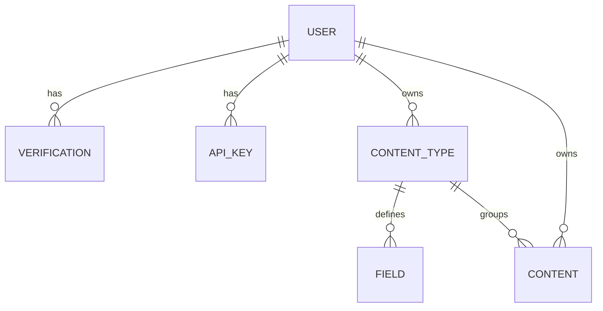

# Vanilla PHP Multi-Tenant Headless CMS REST API

> [!IMPORTANT]
> **Learning Project Disclaimer**  
> This repository is a personal self-learning project built from scratch to explore low-level architectural patterns in PHP. To maximize learning outcomes, **little to no AI assistance** was utilized during its implementation. This is also **not** intended for production environments.

---

## 🏗️ Architectural Overview

Rather than relying on modern heavyweight frameworks, this project implements a lightweight custom framework architecture in Vanilla PHP to handle routing, dependency injection, and database abstraction.

### 1. Custom HTTP Router (`src/Core/Router.php`)
The routing layer uses custom attributes (`#[Route]`) to map HTTP pathways directly to single-action controllers (invokables).
- **Registration**: Routes are registered dynamically in `config/actions.php`.
- **Attribute Parsing**: Uses PHP Reflection to extract attributes (`#[Route(path: '...', method: '...')]`), map them to controller invoke methods, and evaluate required method parameters.
- **Middleware Pipeline**: Routes can declare middleware callbacks (e.g., check login status or anonymous routing).
- **Authentication Guard**: Routes starting with `/api/` are automatically intercepted and authorized via the API authentication system.

### 2. Dependency Injection Container (`src/Core/Container.php`)
An autowiring DI container that recursively resolves dependencies using reflection:
- Constructor dependencies are automatically instantiated and injected.
- Shared instances (e.g., `Container` and `Request`) are registered globally during bootstrap.

### 3. Dynamic Schema Engine (`src/Domain/Field/FieldRepository.php`)
To support customizable entities, the project implements a **dynamic table-per-field** strategy:
- When a tenant creates a new field (e.g., slug `subtitle`), the system automatically runs a DDL query to generate a dedicated table named `field_data_[field_slug]` (e.g., `field_data_subtitle`).
- This dynamic table stores user-specific, context-specific field values mapped back to the primary content entities, providing database-level isolation.

### 4. Dynamic Query Builder (`src/Domain/RepositoryBase.php`)
Provides query-building utilities to automate base database operations:
- **`findAll()`**: Automatically resolves dynamically generated WHERE conditions, query bindings, offsets, and paginates responses by fetching `limit + 1` rows to determine if a next page exists.
- **`buildWhereClauses()`**: Converts PHP arrays into parameterized SQL statements supporting various operators (`=`, `!=`, `LIKE`, `IN`, `BETWEEN`, `IS NULL`, etc.).

---

## 🔒 Security & Utilities

- **Rate Limiting (`src/Core/RateLimiter.php`)**: A session-based rate limiter using IP-based and email-based key hashing to throttle high-frequency requests (e.g., registration attempts).
- **CSRF Protection (`src/Core/CsrfToken.php`)**: Generates and validates CSRF tokens to secure web-based POST requests.
- **API Authentication (`src/Core/ApiAuth.php`)**: Protects `/api/*` endpoints. It parses standard HTTP Basic Authentication where the credentials are:
  ```http
  Authorization: Basic base64(email:api_token)
  ```
  The system matches the token and verified host header origins with the tenant's registered API keys.

---

## 📊 Database Schema

The initial system migration (`migration/000.init.php`) creates the core relational tables:



### Table Structure Detail
1. **`user`**: Stores account details (email, hashed password, role, verification status).
2. **`verification`**: Holds short-lived verification tokens for email confirmation.
3. **`api_key`**: Stores user API keys, mapped to a unique `site_host` value for domain restriction.
4. **`content_type`**: Represents custom collections defined by tenants (e.g., "blog posts", "products").
5. **`field`**: Lists custom attributes assigned to a content type (text, longtext, number, date, time, datetime, email, entity_reference).
6. **`content`**: Serves as the base record index for a custom content entry.
7. **`field_data_[field_slug]` (Dynamic)**: Dynamically generated database tables that hold values for custom fields.

---

## 📡 Route / Endpoint Registry

### Web Interface
| Path | Methods | Middlewares | Description |
|---|---|---|---|
| `/` | `GET` | *None* | Application landing page |
| `/login` | `GET`, `POST` | `isAnonymous` | User login page / session creation |
| `/register` | `GET`, `POST` | `isAnonymous` | Tenant registration (rate-limited) |
| `/dashboard` | `GET`, `POST` | `isLoggedIn` | Admin developer console & API key creator |
| `/logout` | `GET` | `isLoggedIn` | Logs out the current user session |

### Headless REST API (`/api/*`)
All endpoints below are authenticated using API Basic auth (`Authorization: Basic base64(email:api_token)`) and require an `Origin` header.

| Path | Method | Description | Payload Example / Query Params |
|---|---|---|---|
| `/apikeys/create` | `POST` | Create a new domain-restricted API Key | `{"host": "example.com"}` |
| `/api/content-types/create` | `POST` | Create a custom content type | `{"label": "Articles"}` |
| `/api/content-types` | `GET` | List all available content types | *Query:* `limit`, `offset` |
| `/api/fields/create` | `POST` | Create a new custom field & dynamic table | `{"contentTypeId": 1, "label": "Subtitle", "type": "text"}` |
| `/api/fields` | `GET` | List all custom fields | *Query:* `limit`, `offset` |
| `/api/fields/save-data` | `POST` | Save custom field value to dynamic database table | `{"fieldId": 1, "contentTypeId": 1, "contentId": 5, "value": "A Cool Post"}` |
| `/api/content/create` | `POST` | Instantiate a new content record | `{"label": "Post Title", "contentTypeId": 1}` |
| `/api/contents` | `GET` | List all content instances | *Query:* `limit`, `offset` |
| `/api/contents/update` | `PATCH`/`PUT`| Update content properties | `{"args": {"label": "New Title"}, "conditions": {"id": 5}}` |
| `/api/users/create` | `POST` | Programmatic user registration | `{"email": "...", "password": "..."}` |
| `/api/test` | `GET` | API testing / health check | *None* |

---

## ⚙️ Development Setup

The project uses [DDEV](https://ddev.readthedocs.io/) for local environment virtualization.

### 1. Prerequisites
- Docker / Docker Desktop
- DDEV CLI

### 2. Initialization
Clone the repository and start the virtual container system:
```bash
ddev start
```

Install Composer dependencies inside the DDEV environment:
```bash
ddev composer install
```

### 3. Database Migration
A helper script is provided to completely refresh the local MySQL database and run the migrations:
```bash
chmod +x fresh-migrate.sh
./fresh-migrate.sh
```

### 4. Local Execution
Once running, the application is reachable at:
- Web dashboard: `https://php-rest-api.ddev.site` (or the URL outputted by `ddev start`)
- Database connection details are automatically managed by DDEV environment variables.
